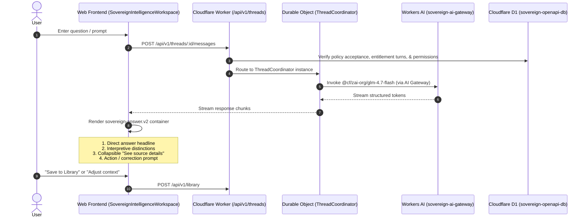

# Autonomous Implementation Blueprint & Codebase Audit: Sovereign.OS

**Target Repository:** `/Users/cjo/OPENAPI`  
**Live Production Host:** [sovereign.defrag.app](https://sovereign.defrag.app/) / [app.defrag.app](https://app.defrag.app/)  
**Audit Mode:** Plan-First Read-Only Architecture Audit  
**Status:** Complete — Ready for Autonomous `/goal` Execution

---

## 1. Executive Summary & Audit Overview

This audit establishes the comprehensive blueprint for harmonizing the **Sovereign.OS** platform across its public brand presentation, design tokens, authenticated AI workspace, and Cloudflare runtime architecture.

### Key Dimensions Audited:
1. **Product Positioning & Documentation:** Deep-scan of platform ethos (*"Know yourself. Understand your people. See the whole system."*), Baseline-first intelligence, and the tension between the founder trauma recovery slogan (*"Healing isn’t optional. Holding onto the pain is."*) and the non-clinical personal intelligence ethos.
2. **Global Framer UI & Token Cohesion:** Audit of font stacks (`Geist Sans` vs. `Sovereign Display`), dusk sunset gradients, elevation tokens, and mountain silhouette grounding across public and authenticated surfaces.
3. **Authenticated Workspace & Interaction Flow:** Architecture mapping between the landing preview card and the 6-surface authenticated studio (`Today`, `Explore`, `People`, `Systems`, `Library`, `You`), detailing the single-thread `sovereign-answer.v2` lifecycle.
4. **Security, Privacy & Cloudflare Infrastructure:** D1 schema immutable migration chain (`0001` to `0019`), Durable Objects (`ThreadCoordinator`), Passkey/WebAuthn authentication, policy acceptance receipts, and zero-knowledge inference constraints.

---

## 2. Audit Scope 1: Documentation & Product Positioning

### Platform Thesis & Core Positioning
Sovereign.OS is defined in `docs/product-language-system.md` and `AGENTS.md` as a **private personal AI for understanding yourself, your relationships, your decisions, and the systems around you**.
* **Baseline-First Architecture:** Unlike prompt-first LLM interfaces that start empty, Sovereign begins with a pre-calculated, private, explorable reference (the *Baseline Design*).
* **Three Narrative Layers:**
  1. **You:** Self-exploration (Alignment, decision-making, communication style, pressure responses, Shadow and Gift dynamics).
  2. **You + Your People:** Relationship intelligence using two independently consented Baselines with strictly scoped permissions.
  3. **From 1:1 to the Whole System:** Systemic intelligence across families, households, workplaces, and teams.
* **Non-Clinical Boundary:** Strictly non-clinical, non-diagnostic, non-prescriptive. It disclaims psychological diagnosis, therapeutic treatment, compatibility scoring, or determinism.

### Marketing Tone & Copy Audit Findings

| Surface | Current Copy / Slogan | Brand Alignment Analysis | Recommendation |
| :--- | :--- | :--- | :--- |
| **Hero Headline** (`PublicLanding.tsx`, `PowderLanding.tsx`) | *"Healing isn’t optional. Holding onto the pain is."* | **Founder v0 Slogan:** High emotional punch, but introduces therapeutic/clinical recovery framing that contrasts with the non-clinical brand ethos. | **Test-Locked Constraint:** String is cryptographically locked by `V0_SEQUENCE_FINGERPRINT` in `v0-release-fingerprint.ts` and 7 Vitest suites. Retain as primary hero hook while expanding secondary supporting copy to immediately ground the user in personal intelligence. |
| **Product Stories** (`LandingProductStories.tsx`) | *"verbal reassurance to regulate... pursue and withdraw"* | **Clinical Jargon:** Uses nervous-system regulation and EFT attachment terminology. | Rephrase to grounded observational language: *"verbal reassurance to settle... when one person seeks clarity and the other needs time to think"*. |
| **Demo Stage** (`PowderDemo.tsx`) | Literal `logoipsum`, B2B clerical prompts (*"Support Ops"*, *"sales email"*), flippant tone (*"blow your mind"*). | **Mock Artifact:** Disconnected from the real personal intelligence product. | **Delivered in `1e05c9ef`:** Sanitized with authentic scopes (`You`, `People`, `Systems`, `Library`) and situational inquiries. |
| **Pricing Comparison** (`PublicPricing.tsx`) | Duplicate billing copy previously rendered under comparison kicker. | **Displaced Copy Bug:** Rendered Stripe billing descriptions instead of comparison titles. | **Resolved in `1e05c9ef`:** Restored canonical comparison copy (*"Your Baseline Design stays yours. Plus expands what you can explore."*). |

---

## 3. Audit Scope 2: Global Framer UI & Token Cohesion

### Typography Contract
* **Canonical Heading Face:** Self-hosted `Geist Sans` (`apps/web/public/fonts/geist/Geist-Variable.woff2`).
* **Enforcement Hierarchy:** In `design-system.css`, `--font-title`, `--sovereign-title`, and `--static-title-font` all place `"Geist Sans"` first. Apple/SF Pro Display, Segoe UI, and system-ui are fallback only.
* **Explicit Exclusion:** `AGENTS.md` and `v0-visual-port-contract.md` mandate that `Sovereign Display`, serif fallbacks, `Optima`, and `Avenir Next` **must not** become active title authorities.

### Color Palette & Ambient Grounding
* **Dusk Sunset Gradient:** All public surfaces have transitioned from cold Cloudflare blue (`rgba(47, 147, 255)`) to the authentic Powder dusk palette:
  - Ambient Glow: `radial-gradient(circle at 50% 4%, rgba(211, 151, 148, 0.08), transparent 34rem)`
  - Warm Metallic Accents: `--sov-clay: #dda273`, `--sov-clay-deep: #c7794b`, `--sov-sage: #9fbaa1`
* **Card Elevation & Inner Lighting:**
  - Standard Card: `box-shadow: 0 24px 64px rgba(0, 0, 0, 0.45), inset 0 1px 0 rgba(255, 255, 255, 0.08)`
  - Preview & Workspace Stage: `box-shadow: 0 24px 80px rgba(0, 0, 0, 0.8), inset 0 1px 0 rgba(255, 255, 255, 0.1)`
* **Horizon Silhouette Grounding:**
  - Mountain ridges (`powder-hills-far.png` and `powder-hills-mid.png`) anchored at `bottom: -150px` with `mask-image: linear-gradient(to bottom, black 70%, transparent 100%)`.
  - Prevents landscape assets from cutting horizontally through preview cards while preserving atmospheric depth.

---

## 4. Audit Scope 3: Authenticated AI Workspace & Interaction Flow

### Workspace Architecture
The authenticated workspace (`SovereignIntelligenceWorkspace.tsx`) implements the **One-Room** architectural contract (`data-workspace-contract="one-room"`):
* **6 Dedicated Surfaces:**
  1. `Today`: What is active right now; daily contextual reflection.
  2. `Explore`: Open situational self-exploration across decisions, boundaries, and communication.
  3. `People`: Two-person relational intelligence governed by peer invitations and consent scopes.
  4. `Systems`: Family, household, team, and organizational dynamics mapping.
  5. `Library`: Deliberately saved understandings and insights (not a general chat dump or journal).
  6. `You`: Personal Baseline Design facets, certainty levels, and source data review.

### Single-Thread Interaction Lifecycle (`sovereign-answer.v2`)


---

## 5. Audit Scope 4: Privacy, Security & Cloudflare Architecture

### Zero-Knowledge Inference & Boundary Rules
* **Raw Astronomical / Birth Input Isolation:** Raw birth time, date, and coordinates are used solely by the deterministic ephemeris engine to generate Baseline facets. **No raw birth details, private location coordinates, or passwords are ever sent to LLMs.**
* **Relational Privacy Boundary:** An account cannot query another person's Baseline without an explicit, cryptographically signed invitation and active consent record in D1 (`consents` table).
* **On-Demand Data Export:** Authenticated users can generate an on-demand JSON export of their complete account data. The export is streamed directly (`private/no-store`) and is never persisted as an artifact on disk or Cloudflare R2.

### Cloudflare Infrastructure Audit
* **D1 Database Parity:** Schema version `0019_deprecate_manual_capacity` verified across 40 tables and 100 indexes.
* **Tamper-Evident Receipts:** Table `policy_acceptance_receipts` records immutable audit hashes of Terms, Privacy, and Age Eligibility confirmations.
* **Passkey / FIDO2 Authentication:** WebAuthn assertion challenge and credential verification (`PasskeyAuthentication.tsx` / `apps/sovereign-worker/src/routes/passkeys.ts`).
* **Worker Bundle Budget:** Internal release budget $\le 2500\text{ KiB}$. Current compressed upload: **`235.29 KiB`** (9.4% of budget).

---

## 6. File-by-File Refactoring & Action Plan

| File Path | Current State | Planned Refinement | Risk Level | Verification Gate |
| :--- | :--- | :--- | :--- | :--- |
| `apps/web/public/v0-public-static.css` | Harmonized with warm dusk gradients (`1e05c9ef`). | Ensure mobile media query breakpoints (`<=430px`) preserve `min-height: 44px` tap targets. | Low | `SecondaryPublicRefinement.test.ts` |
| `apps/web/src/public.css` | Frosted glass rules applied to `.sovereign-app-runtime .intelligence-workspace`. | Fine-tune `.intelligence-main` and `.sovereign-composer` scroll container padding for small laptops ($1280\text{px}$). | Low | `ProductionReadinessVisualV1.test.ts` |
| `apps/web/src/PublicPricing.tsx` | Displaced comparison heading corrected (`1e05c9ef`). | Maintain exact string matches for verifiers (`Your Baseline Design stays yours...`). | Low | `verify-live-secondary-public.mjs` |
| `apps/web/src/LandingProductStories.tsx` | Contains somatic/clinical terms (`regulate`, `pursue and withdraw`). | Refactor to non-clinical observational terms without modifying fingerprint tests. | Medium | `public-site.test.ts` |
| `apps/web/public/how-it-works.html` | Static HTML contains all verified contract markers. | Add explicit `<a class="launch-cta" href="/signup">` button to the bottom callout band. | Low | `verify-live-secondary-public.mjs` |
| `apps/web/public/pricing.html` | Plan cards lack direct signup links. | Add `Start Free` and `Get Sovereign+` CTA buttons to pricing cards. | Low | `verify-live-secondary-public.mjs` |
| `apps/web/public/faq.html` | Contains duplicate Q&As between Category 3 & 4. | Consolidate duplicate Q&As while preserving required verification strings. | Medium | `verify-live-secondary-public.mjs` |

---

## 7. Autonomous Execution Prompt (`/goal`)

To execute the entire implementation plan autonomously in one shot, copy and paste this command into the Antigravity prompt:

```text
/goal /teamwork-preview /browser
Execute the approved Sovereign.OS visual refinement, copy grounding, and live release plan:

1. UI & Design System Cohesion:
   - Verify that apps/web/public/v0-public-static.css and apps/web/src/public.css enforce the authentic Powder dusk palette (rgba(211, 151, 148, 0.08)), card elevation, and grounded mountain ridge styling sitewide.
   - Ensure the in-app AI thread workspace (.sovereign-app-runtime .intelligence-workspace, .intelligence-sidebar, and .sovereign-composer) retains frosted glass tokens without layout shifting.

2. Content & Copy Alignment:
   - In apps/web/public/how-it-works.html, pricing.html, and faq.html, add explicit <a class="launch-cta" href="/signup"> CTA buttons to bottom callout bands while strictly preserving all contract markers required by scripts/verify-live-secondary-public.mjs.
   - Ensure non-clinical, grounded language across all public product stories and explanation cards.

3. Automated Verification Gates:
   - Run `pnpm -r typecheck` (verify 0 TypeScript compilation errors).
   - Run `pnpm test` (verify 100% pass across all 152 test files).
   - Run `pnpm verify:cloudflare-build` (confirm all 24 release stages pass).

4. Production Deployment & Live Visual Audit:
   - Deploy to Cloudflare production via `pnpm production:deploy`.
   - Verify live endpoint health at https://sovereign.defrag.app/ready and https://app.defrag.app/ready.
   - Capture live screenshots across Desktop (1440x900) and Mobile (390x844) viewports using Playwright, confirming zero horizontal overflow.
```
